# 🚀 GoyFeed - Modern Social Media Platform


A full-stack social media application with real-time engagement features, built with React, GraphQL, and PostgreSQL.

---


## 🔍 Navigation
- [✨ Key Features](#-key-features)
- [🏗 Architecture Overview](#-architecture-overview)
- [🚀 Deployment](#-deployment)
- [🏗 Setup Guide](#-setup-guide)
- [⚖️ Assumptions & Tradeoffs](#️-assumptions--tradeoffs)
- [🛠 Troubleshooting](#-troubleshooting)
- [🙏 Acknowledgments](#-acknowledgments)
- [📚 Resources](#-resources)
- [📬 Contact](#-contact)
- [📜 License](#-license)

## ✨ Key Features

### Core Functionality
✅ **Secure Authentication** - Using jwt tokens to auntenticate users  
✅ **Rich Content Creation** - Posts with text, images, and media  
✅ **Social Networking** - Follow/unfollow system.  
✅ **Real-time Interactions** - Instant like notifications.
✅ **Optimistic UI** - Immediate feedback on user actions  

### Technical Highlights
⚡ **Type-Safe Stack** - TypeScript across frontend and backend  
⚡ **Modern Styling** - Tailwind CSS with responsive design  
⚡ **Efficient Data Loading** - GraphQL with Apollo Client  
⚡ **ORM Power** - Prisma for type-safe database operations  

---

## 🏗 Architecture Overview

### Tech Stack

#### **Frontend**
<p align="left">
  
  
  
  
</p>

#### **Backend**
<p align="left">
  
  
  
  
  
</p>

### System Design

```mermaid
graph TD
    A[React Frontend] -->|GraphQL| B[Express Server]
    B -->|Prisma Client| C[(PostgreSQL)]
    C --> B
    B --> A
    D[Client Browser] -->|WebSocket| A
    style A fill:#336791,stroke:#333
    style B fill:#000000,stroke:#333
    style C fill:#336791,stroke:#333
```


## 🚀 Deployment

The application is deployed across multiple platforms:

### 🔧 Frontend (Vercel)
- Hosted on [Vercel](https://vercel.com/)
- Automatic CI/CD from the `main` branch
- **Live URL:** [https://goyfeed.vercel.app](https://goyfeed.vercel.app)

### 🛠 Backend (Render)
- Node.js server deployed on Render (free tier)
- **GraphQL Endpoint:** [https://goyfeed.onrender.com/graphql](https://goyfeed.onrender.com/graphql)
- Connected to a PostgreSQL database (also on Render)

> ⚠️ **Note:** The backend may respond slowly on initial requests due to Render's free tier, which spins down inactive instances. The first request may take 30–60 seconds, but subsequent requests will be faster while the instance remains active.

### 🗄 Database (Render)
- PostgreSQL instance hosted on Render
- Connected to the backend server


# GoyFeed - Complete Setup Guide

## Prerequisites

Before setting up **GoyFeed**, ensure you have the following installed:

- **Node.js** v18+
- **PostgreSQL** 15+
- **npm**
- **Git**

---

## 1. Frontend Setup (React + TypeScript + Tailwind)

### Clone & Install

Clone the repository and install dependencies:

```bash
git clone https://github.com/HassanMunene/Goyfeed
cd Goyfeed/frontend
npm install


## After installing packages on the frontend now it time to configure the environment variable for frontend. What we need is the endpoint for the backend communicate with it.

### so create a file named .env in the frontend.

```bash
./frontend/.env

VITE_GRAPHQL_ENDPOINT=http://localhost:4000/graphql
```

After that start the frontend server for it to run:


```bash
npm run dev
```


## 2. Backend Setup (Express + GraphQl + Postgress)

### Clone & Install

Clone the repository and install dependencies:

```bash
cd Goyfeed/backend
npm install
```

## After installing packages on the backend now it time to configure the environment variable for backend.

### so create a file named .env in the backend.

```bash
./backend/.env

DATABASE_URL="postgresql://<username>:<password@localhost:5432/<db_name>?schema=public"
APP_SECRET=<your secret key>
PORT=4000
```

## After that Initialize Database
Run the Prisma migration command to set up the database schema:

```bash
npx prisma migrate dev --name init
npx prisma generate
```

After that start the bakend server for it to run:


```bash
npm run dev
```

## ⚖️ Assumptions & Tradeoffs

### Key Assumptions
1. **User Behavior**  
   - Assumed most users will interact via mobile devices (optimized mobile-first UI)
   - Expected average post length < 500 characters (optimized text rendering)

2. **Technical Environment**  
   - Modern browsers with ES2020 support (no IE11 compatibility)
   - Stable internet connection (optimistic UI with graceful degradation)

3. **Data Requirements**  
   - Read-heavy workload (caching strategy favors post fetching)
   - Most users follow < 100 accounts (optimized feed generation)

### Deliberate Tradeoffs
| Decision | Benefit | Compromise |
|----------|---------|------------|
| **GraphQL over REST** | Flexible queries, reduced over-fetching | Increased complexity in caching |
| **JWT over Sessions** | Stateless scalability | More challenging token revocation |
| **Prisma over raw SQL** | Type-safe queries, faster development | Slight performance overhead |
| **Optimistic UI** | Instant user feedback | Complex rollback handling |
| **Client-side Routing** | Smoother navigation | SEO challenges (mitigated with SSR-ready structure) |

### Risk Mitigations
- **Database Load**: Implemented Redis caching for frequent queries
- **JWT Security**: Short expiration + refresh token rotation
- **Mobile Performance**: Lazy-loaded components and code splitting
- **Offline Use**: Service worker caching for core assets

---

## 🛠 Troubleshooting

### Common Issues & Solutions
| Problem | Solution |
|---------|----------|
| Database connection fails | Verify PostgreSQL is running and credentials in `.env` match |
| GraphQL errors | Check server logs and run `npx prisma generate` |
| Frontend not updating | Clear cache and reinstall dependencies |
| JWT authentication issues | Verify token expiration and refresh logic |

---

## 🙏 Acknowledgments

Special thanks to:
- The React and GraphQL communities
- Prisma team for their excellent ORM
- Tailwind CSS for revolutionary styling
- All open-source contributors

---


## 📬 Contact

For support or questions:
- [GitHub Issues](https://github.com/HassanMunene/)
- Email: [awanzihassan6@gmail.com@](mailto:awanzihassan6@gmail.com)

---

## 📜 License

MIT © [Hassan Munene](https://github.com/HassanMunene)

[](https://opensource.org/licenses/MIT)

[](https://github.com/HassanMunene/Goyfeed/stargazers)